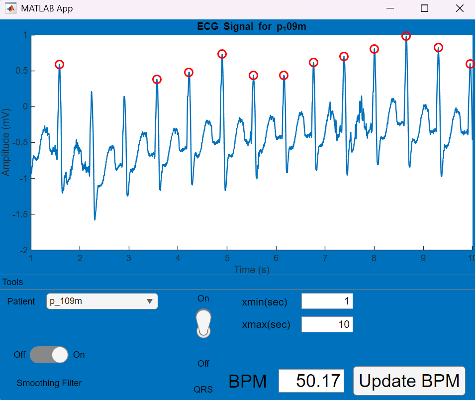

# MATLAB ECG Viewer and Analyzer (GUI)

A MATLAB App Designer GUI that loads an ECG record, plots the signal, detects QRS peaks, computes BPM, applies a smoothing filter, and lets you choose the time range you want to view.

---

## Features
- Patient selector to choose an ECG record
- Live ECG plot
- QRS detection overlay with peak markers
- BPM calculation from R-R intervals
- Smoothing filter with adjustable window
- Time window control to focus on any part of the record

---

## Repository contents
- `AppGUI`  main GUI app (App Designer `.mlapp` or `.m`)
- `loadMITecg`  helper that loads the selected ECG record
- `Plot`  helper used by the app to render signals and overlays
- `MatlabGUI.png`  screenshot of the app

> GitHub may hide the `.mlapp` or `.m` extensions in the file list preview.

---

## Requirements
- MATLAB R2021b or newer recommended  
- Signal Processing Toolbox helpful but not required  
- ECG data files
  - Place records in a `data/` folder or the repo root
  - MIT-BIH style records or plain arrays are supported
  - Confirm the sampling rate your files use (360 Hz is common for MIT-BIH)

---

## How to use the app

- Select patient
  - Use the drop-down to choose a record. The app calls loadMITecg to read it.
- Set the time window
  - Use the slider or the start and end boxes to pick the time range to display.
- Apply smoothing
  - Enable the smoothing option and adjust the window size to reduce noise.
- Detect QRS
  - Enable QRS detection. Peak markers will appear on the plot.
- Read BPM
  - The BPM display updates using R-R intervals in the visible window.

## Algorithms

- QRS detection uses a derivative, squaring, moving average integration, and a threshold
- Smoothing uses a moving average or similar low-pass filter
- BPM is computed from the median R-R interval in the current time window

